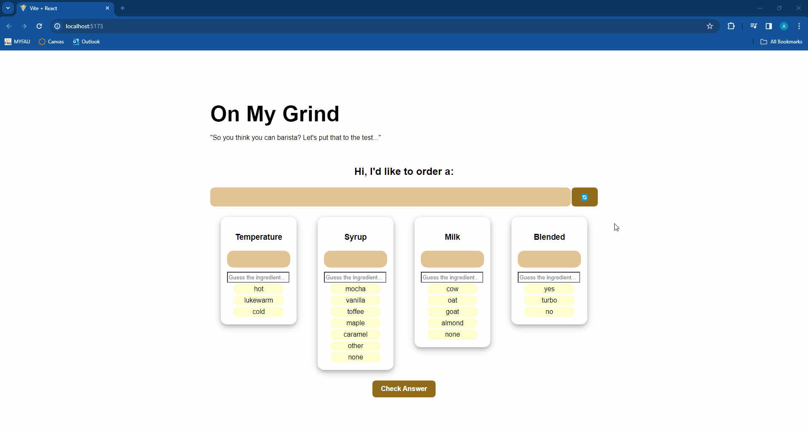

# Web Development Lab 3 - BrewMaster Challenge

Introducing the BrewMaster Challenge! 🚀

Get ready for an electrifying experience with the BrewMaster App! Inspired by the addictive and engaging nature of Wordle, this React-powered web application is not just your average drink-ordering platform — it's an immersive journey into the world of mixology and magic. 

But this is no ordinary beverage-making escapade. Oh no! The BrewMaster App is here to challenge your senses and ignite your creativity like never before. Armed with a dazzling array of options involving temperature, flavor, milk type, and blendedness, you'll find yourself on a quest to decode the secret recipes of iconic Starbucks beverages.

Will you rise to the challenge and concoct the perfect brew, or will you falter in the face of the ultimate barista challenge? The choice is yours.

So, gather your courage, sharpen your senses, and prepare to unleash your inner BrewMaster. The journey awaits, and the thrill of victory is within your grasp. Are you ready to brew up some magic? Let the adventure begin!

## Table of Contents
1. [Features](#features)
2. [Installation](#installation)
3. [Usage](#usage)
4. [Video Walkthrough](#video-walkthrough)
5. [Notes](#notes)
6. [License](#license)

## Features
- Random drink selection: Users are presented with a random drink to prepare from a curated list of drink options from Starbucks.
- Ingredient selection: Users can choose ingredients for temperature, milk type, syrup flavor, and whether the drink is blended.
- Validation: The app meticulously compares user-chosen ingredients against the correct recipe, ensuring precision and accuracy at every step.
- Custom input: Users can type their answers for ingredient selection.

## Installation
To run the BrewMaster App locally, follow these steps:

1. Clone this repository to your local machine using **'git clone'**.
2. Navigate to the project directory and open it in your preferred code editor such as VS Code.
3. Install dependencies by typing **'npm install'** in the terminal.
4. Start the development server by entering **'npm start'**.
5. Copy the link shown in the terminal into your web browser to view the app.

## Usage
Once the app is running, follow these steps to use it:

1. Kick off your brewing adventure by clicking the "🔄" button to select a random drink to prepare.
2. Next type your choices for temperature, milk, syrup, and blended into the respective boxes. Remember, your choices must align with the options listed.
3. Once you've finalized your concoction, click the "Check Answer" button to compare your choices with the correct recipe.
4. Receive instant feedback on the acuarracy of your selections and adjust as needed.
5. Ready to take on more challenges? Repeat the process to prepare different drinks and hone your barista skills to perfection!

## Video Walkthrough

Here's a walkthrough of implemented required features:

GIF created with ScreenToGif.

## Notes

Contributions to the BrewMaster App are not just welcome, they're essential for making our app the best it can be! We value input from the community and encourage you to get involved. Whether you've found a bug, have a feature request, or want to contribute enhancements, we're eager to hear from you.

To report a bug or request a new feature, please open an issue on our GitHub repository. Be sure to include detailed information, such as steps to reproduce the issue or a clear description of the desired functionality. We appreciate your efforts in maintaining code quality and ensuring that our app remains robust and reliable for all users.

Thank you for your interest in contributing to the BrewMaster App. Together, we can brew up something truly amazing!

## License

    Copyright 2024 - Alex Nikirk

    Licensed under the Apache License, Version 2.0 (the "License");
    you may not use this file except in compliance with the License.
    You may obtain a copy of the License at

        http://www.apache.org/licenses/LICENSE-2.0

    Unless required by applicable law or agreed to in writing, software
    distributed under the License is distributed on an "AS IS" BASIS,
    WITHOUT WARRANTIES OR CONDITIONS OF ANY KIND, either express or implied.
    See the License for the specific language governing permissions and
    limitations under the License.# lab-3
